# oBiletCase

Kullanıcının kalkış, varış ve tarih seçerek otobüs seferi arayabildiği bir ASP.NET Core MVC uygulaması. Arama sonucunda dönen seferler kalkış saatine göre sıralanır, filtrelenebilir ve sıralanabilir; her kart sefer, firma ve iptal/koltuk politikası detaylarını gösterir. Uygulama iki ekrandan oluşur: arama (Index) ve sonuç listesi (Journey Index).

Tüm veri, kullanıcı başına izole edilmiş bir session üzerinden dış bir otobüs bileti sağlayıcısının (bundan sonra "sağlayıcı API" olarak anılacak) HTTP API'sinden gelir. Sağlayıcıya giden hiçbir istek tarayıcıdan doğrudan yapılmaz; tüm dış çağrılar backend üzerinden geçer.

## Mimari

Çözüm beş projeden oluşur ve bağımlılıklar tek yönlüdür:

```
oBiletCase.Web            -> Application, Infrastructure (yalnızca DI kaydı için)
oBiletCase.Application    -> Domain
oBiletCase.Infrastructure -> Application, Domain
oBiletCase.Domain         -> (bağımsız)
oBiletCase.Tests          -> tüm katmanlar
```

- **Web** — ASP.NET Core MVC composition root. Controller'lar sadece HTTP orkestrasyonu yapar: bir Application akışını çağırır, sonucu bir View veya HTTP yanıtına çevirir. İş kuralı veya dış API'ye özgü kod içermez.
- **Application** — feature bazlı organize edilmiştir (`Journeys`, `Locations`, `Sessions`), katman bazlı değil. Her feature kendi DTO'sunu, servis arayüzünü ve validator'ını taşır. HTTP/JSON detaylarından tamamen habersizdir.
- **Domain** — bilinçli olarak neredeyse boş. Bu uygulamanın kendine ait, API'den bağımsız bir iş kuralı (örneğin bir rezervasyon/iptal kuralı) yok; olan tek kurallar (aynı lokasyon seçilemez, geçmiş tarih seçilemez) zaten birer *giriş validasyonu* ve `Application` katmanında modellenmiş durumda. Katmanı doldurmak için yapay domain sınıfları eklenmedi.
- **Infrastructure** — sağlayıcı API'siyle ilgili her şeyin yaşadığı yer: `IHttpClientFactory` yapılandırması, session/device bilgisinin isteklere eklenmesi, request/response DTO'ları, hata/timeout yönetimi ve `Application` sözleşmelerine mapping. `Application` ve `Domain` bu katmanın hiçbir somut tipini bilmez (Dependency Inversion) — `Infrastructure`, `Application`'da tanımlı arayüzleri (`IBusLocationService`, `IBusJourneyService`, `IObiletSessionAccessor`) implemente eder.
- **Tests** — xUnit + Moq. Gerçek sağlayıcı API'sine bağımlı test yoktur; servis testleri sağlayıcı istemcisini (`IObiletApiClient`) mock'lar, controller testleri servisleri mock'lar.

## Teknoloji tercihleri

- **.NET 10 / ASP.NET Core MVC**, Razor Views.
- **FluentValidation** — sunucu tarafı validasyon (aynı lokasyon, geçmiş tarih), hem arama formunda hem sonuç sayfasında (bookmarklanmış/manipüle edilmiş bir URL'ye karşı ikinci bir savunma katmanı olarak) çalışır.
- **Vanilla CSS/JS** — Bootstrap, Tailwind veya jQuery kullanılmadı. Lokasyon autocomplete'i, tarih seçici, sıralama/filtreleme dropdown'ları ve mobilde drawer'a dönüşen filtre paneli sıfırdan yazıldı. Bunun nedeni framework eksikliği değil; bu ölçekte bir arayüz için genel amaçlı bir CSS/JS kütüphanesinin getirdiği boyut ve soyutlama maliyetinin karşılığını vermemesi.
- **`IMemoryCache`** — hem sağlayıcı session'ı hem de filtresiz lokasyon listesi (bkz. Performans notu) için. Uygulama tek instance çalıştığı sürece dağıtık bir cache'e (Redis vb.) gerek yok; bunu eklemek bu ölçekte gerçek bir problemi çözmeden bir dış bağımlılık eklemek olurdu.
- **xUnit + Moq** — servis ve controller testleri.
- **Swashbuckle (Swagger)** — uygulamanın tek gerçek JSON API sözleşmesi olan lokasyon arama uç noktası için. Sayfa render eden controller'lar (Home, Journeys, Culture) bilinçli olarak Swagger'ın dışında tutulur; onlar bir API sözleşmesi değil, HTML sayfası döner.
- **Docker** — çok aşamalı bir `Dockerfile` (SDK ile build, ASP.NET runtime ile çalıştırma).
- **GitHub Actions** — push/PR'da restore → build → test → Docker image build. Bir deploy hedefi (sunucu, registry, bulut hesabı) tanımlı olmadığı için pipeline CI ile sınırlı tutuldu; CD, gerçek bir ortam bulunmadığı için eklenmedi.

## Öne çıkan özellikler

- Kalkış/varış alanlarında debounce'lu, klavyeyle gezilebilir metin araması (autocomplete).
- Kalkış/varış swap butonu, "Bugün"/"Yarın" hızlı tarih seçimi.
- Aynı lokasyon ve geçmiş tarih seçimlerine karşı hem istemci hem sunucu tarafında validasyon.
- Son aramanın (kalkış, varış, tarih) `localStorage` ile hatırlanması ve bir sonraki ziyarette form alanlarının otomatik doldurulması; ilk ziyarette ise alanlar sağlayıcının döndürdüğü varsayılan lokasyon sıralamasına göre doldurulur.
- Sefer sonuçlarının kalkış saatine göre sıralı listelenmesi; kullanıcı tarafında (sayfa yenilenmeden, saf istemci tarafı JS ile) kalkış/fiyat bazlı yeniden sıralama ve saat aralığı/koltuk düzeni filtreleri.
- Her sefer kartında firma logosu, özellik ikonları, 5 yıldızlı firma puanı; genişletildiğinde iptal koşulu, kimlik zorunluluğu, oturma düzeni gibi ek bilgiler.
- Türkçe/İngilizce arayüz; tüm kullanıcıya görünen metinler merkezi kaynaklardan yönetilir.
- Merkezi hata yönetimi: beklenmeyen hatalar kullanıcıya teknik detay sızdırmadan genel bir hata sayfasına (HTML istekleri) veya JSON hata yanıtına (AJAX istekleri) yönlendirilir; tüm teknik detaylar `ILogger` ile loglanır, hiçbir secret/session değeri loglanmaz.

### Performans notu

Sağlayıcı API'si İngilizce dil parametresiyle çağrıldığında lokasyon listesi uç noktası ölçülebilir şekilde çok daha yavaş yanıt veriyor (yaklaşık 40-60 saniye, Türkçe'de ~200ms). Bu, sağlayıcının kendi tarafındaki bir davranış; bizim isteğimizin şeklinden bağımsız. Buna karşı iki önlem alındı: filtresiz lokasyon sorgusu dile göre kısa süreliğine cache'lenir, ve sayfa yüklemesini bloklamaması gereken varsayılan-değer doldurma çağrısı ayrı, kısa bir zaman aşımıyla sınırlandırıldı. Autocomplete alanlarındaki her arama isteği de en fazla 15 saniye sürer; bu sürede yanıt gelmezse istek iptal edilip normal hata durumu gösterilir.

## Bilinçli olarak yapılmayanlar

- **MediatR / CQRS yok.** Uygulamanın akışları (arama, lokasyon listeleme, sefer listeleme) tek adımlık, basit servis çağrıları; bir mediator katmanı burada dolaylılık eklemekten başka bir şey yapmaz.
- **AutoMapper yok.** Katmanlar arası eşlemelerin tamamı 2-3 alanlık düz projeksiyonlar; bunun için ayrı bir mapping kütüphanesi ve profil dosyaları kurmak, çözdüğü problemden daha pahalı bir soyutlama olurdu.
- **Redis / dağıtık cache yok.** Yukarıda değinildi — tek instance'lık bir dağıtım için `IMemoryCache` yeterli ve doğru araç.
- **Genel bir `Result<T>` / hata-kodu döndürme deseni yok.** Beklenen hata sınıfları (sağlayıcı API'sinin döndürdüğü başarısız durumlar, timeout) controller seviyesinde dar kapsamlı `catch` blokları ile normal akış olarak ele alınıyor; ayrı bir Result tipi bu ölçekte gereksiz bir katman olurdu.
- **CD pipeline yok.** Elimizde gerçek bir deployment hedefi (sunucu, container registry, bulut ortamı) olmadığından, olmayan bir hedefe sahte bir deploy adımı eklemek yerine CI restore/build/test/image-build ile sınırlı tutuldu.
- **Global bir arama/favori geçmişi sunucuda tutulmuyor.** Sağlayıcı API'sinde böyle bir uç nokta yok; son arama bilinçli olarak yalnızca istemci tarafında (`localStorage`) tutuluyor.

## Yapay zeka destekli geliştirme

Bu projenin birçok yerinde yapay zekadan yararlandık ve bu süreç, hazırladığımız `AGENTS.md` içinde tanımlı sabit bir çalışma çerçevesi altında geliştirildi: mimari sınırların değiştirilmemesi, sağlayıcı API'sinin davranışının doküman/örnek olmadan asla varsayılmaması, gereksiz soyutlama eklenmemesi, önemli mimari kararlarda onay alınması gibi kurallar baştan sabitlendi. Kapsam kendiliğinden büyümedi, uydurma API davranışı koda girmedi, gereksiz bağımlılık eklenmedi. Sonuçta ortaya çıkan her karar için "neden" sorusuna somut bir cevap var; bu README'deki gerekçeler de o sürecin bir özeti.

## Çalıştırma

Gereksinim: .NET 10 SDK.

```
dotnet restore
dotnet build oBiletCase.slnx
dotnet test oBiletCase.slnx
dotnet run --project oBiletCase.Web
```

Sağlayıcı API'sine erişim için gereken `ApiClientToken` bir secret'tır ve depoya eklenmez; `appsettings.json` içinde bu alan her zaman boş bırakılır. Yerel geliştirmede `dotnet user-secrets` ile tanımlanır:

```
dotnet user-secrets set "oBiletAPI:ApiClientToken" "<token>" --project oBiletCase.Web
```

`oBiletAPI:BaseUrl` gizli olmadığı için `appsettings.json` içinde tanımlıdır.

### Docker

```
docker build -t obiletcase-web .
docker run --rm -p 8080:8080 -e "oBiletAPI__ApiClientToken=<token>" obiletcase-web
```

Uygulama `http://localhost:8080` üzerinde ayağa kalkar. `oBiletAPI:BaseUrl` gibi gizli olmayan config değerleri de aynı `__` kuralıyla ortam değişkeni olarak override edilebilir.

### Swagger

`/swagger` altında, uygulamanın tek gerçek JSON uç noktası olan lokasyon arama endpoint'inin sözleşmesi görüntülenebilir.

### CI

`.github/workflows/ci.yml`, her push/PR'da restore, build, test (`.trx` sonuçları artifact olarak yüklenir) ve Docker image build adımlarını çalıştırır.

## Ekran görüntüleri

Görsele tıklayınca tam boyutta açılır.

### Arama

<table>
  <tr>
    <td width="72%" valign="top">
      <p><strong>Masaüstü</strong></p>
      <a href="public/images/desktop/home.png">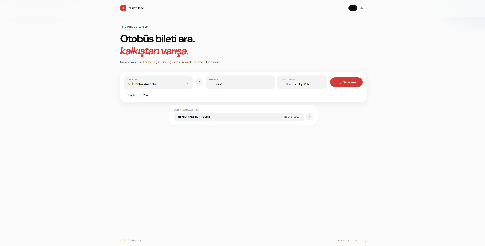</a>
    </td>
    <td width="28%" valign="top">
      <p><strong>Mobil</strong></p>
      <a href="public/images/mobile/home.png">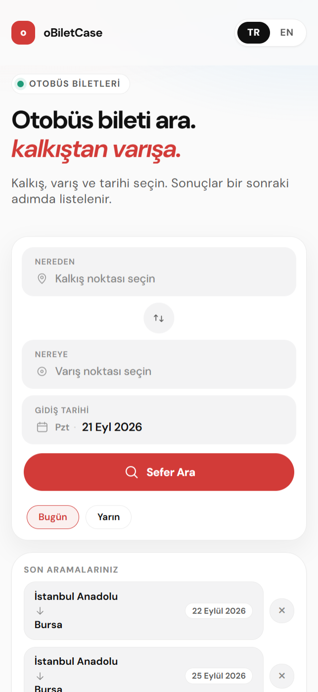</a>
    </td>
  </tr>
</table>

### Doldurulmuş arama formu

<table>
  <tr>
    <td width="72%" valign="top">
      <p><strong>Masaüstü</strong></p>
      <a href="public/images/desktop/fulfilled_inputs.png">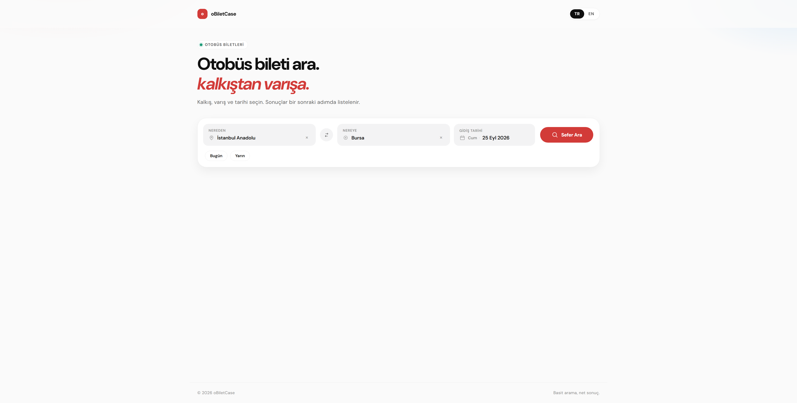</a>
    </td>
    <td width="28%" valign="top">
      <p><strong>Mobil</strong></p>
      <a href="public/images/mobile/fulfilled_inputs.png">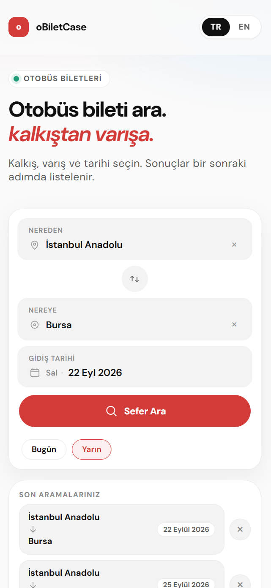</a>
    </td>
  </tr>
</table>

### Sefer sonuçları

<table>
  <tr>
    <td width="72%" valign="top">
      <p><strong>Masaüstü</strong></p>
      <a href="public/images/desktop/list_page.png">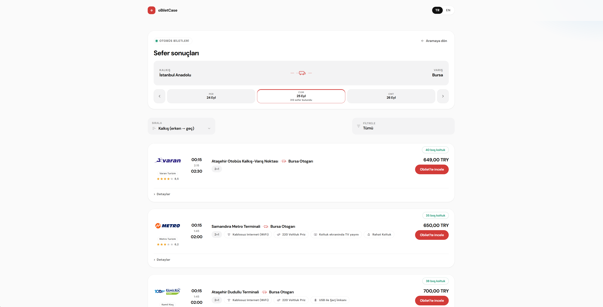</a>
    </td>
    <td width="28%" valign="top">
      <p><strong>Mobil</strong></p>
      <a href="public/images/mobile/list_page.png">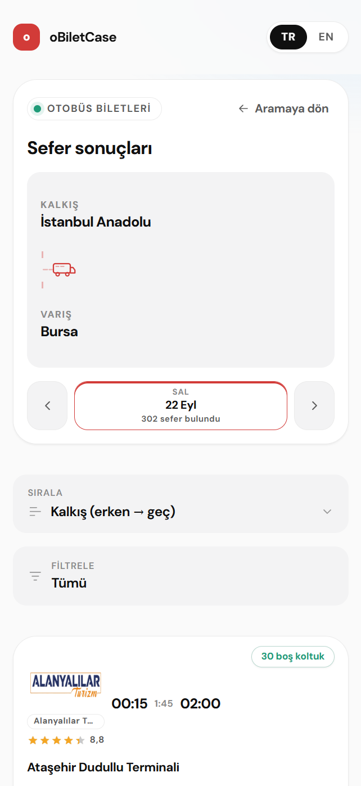</a>
    </td>
  </tr>
</table>

### Sıralama

<table>
  <tr>
    <td width="72%" valign="top">
      <p><strong>Masaüstü</strong></p>
      <a href="public/images/desktop/sort_field.png">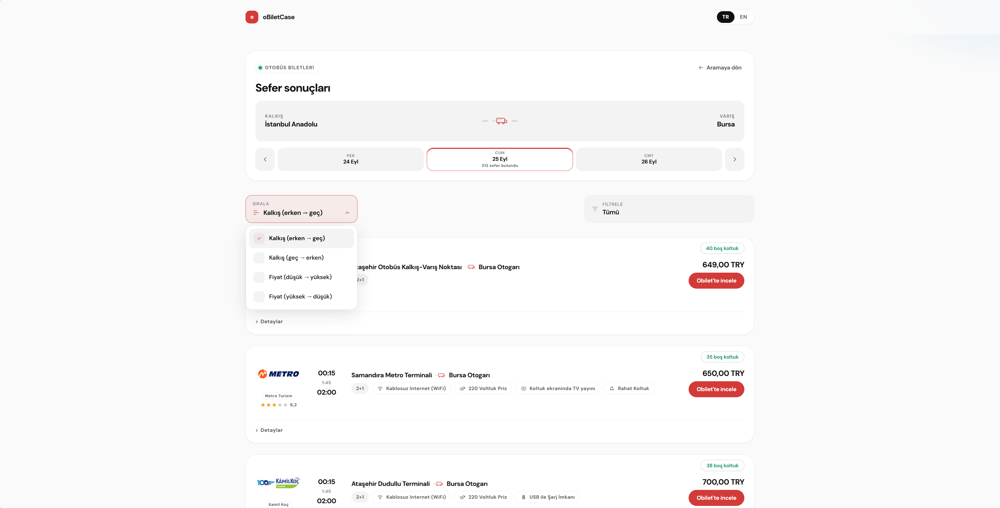</a>
    </td>
    <td width="28%" valign="top">
      <p><strong>Mobil</strong></p>
      <a href="public/images/mobile/sort_field.png">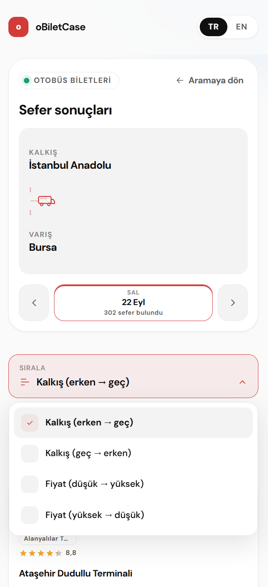</a>
    </td>
  </tr>
</table>

### Filtreleme

<table>
  <tr>
    <td width="72%" valign="top">
      <p><strong>Masaüstü</strong></p>
      <a href="public/images/desktop/filter.png">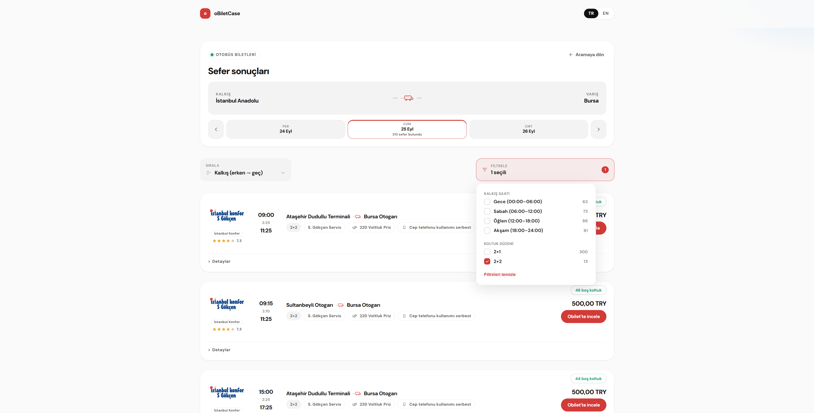</a>
    </td>
    <td width="28%" valign="top">
      <p><strong>Mobil</strong></p>
      <a href="public/images/mobile/filter.png">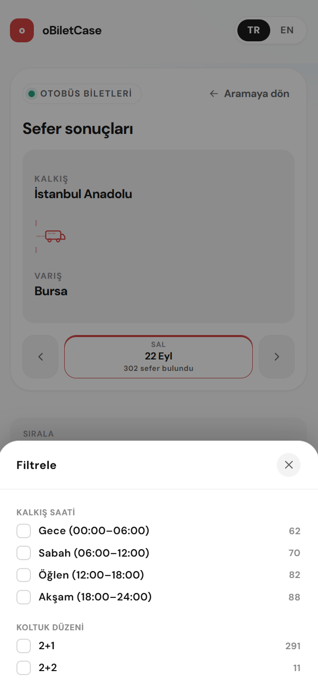</a>
    </td>
  </tr>
</table>

### Genişletilmiş sefer detayı

<table>
  <tr>
    <td width="72%" valign="top">
      <p><strong>Masaüstü</strong></p>
      <a href="public/images/desktop/expanded_card.png">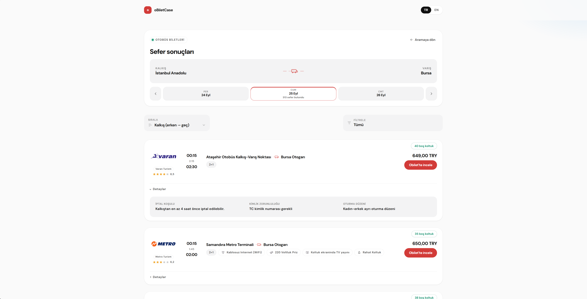</a>
    </td>
    <td width="28%" valign="top">
      <p><strong>Mobil</strong></p>
      <a href="public/images/mobile/expanded_card.png">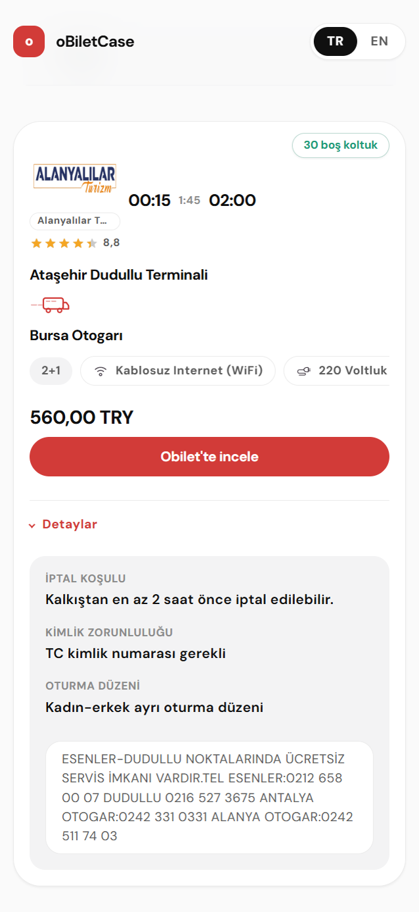</a>
    </td>
  </tr>
</table>
